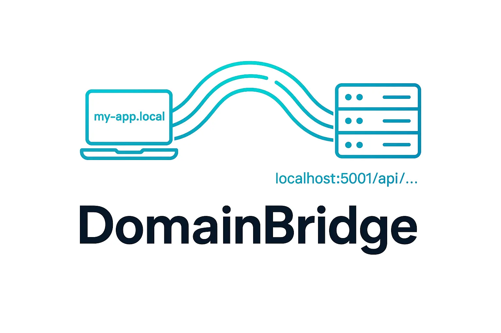

# DomainBridge

<div align="center">
  
  <h3>A lightning-fast local domain proxy for developers</h3>
</div>

## 🚀 Overview

DomainBridge is a powerful yet simple HTTP proxy tool designed for developers who need to map custom domains to local services. It's perfect for testing applications that rely on specific domain names, API endpoints, or complex URL structures.

Built with [Bun](https://bun.sh) for maximum performance and minimal overhead.

## ✨ Features

- **Custom Domain Mapping**: Map any domain name to your local services
- **Path Rewriting**: Redirect requests to specific base paths on your target server
- **Automatic Hosts Configuration**: Optionally update your `/etc/hosts` file automatically
- **Fast & Lightweight**: Built on Bun's native HTTP capabilities for minimal overhead
- **Dry Run Mode**: Test your configuration without making actual changes
- **Simple CLI Interface**: Easy-to-use command line interface

## 📦 Installation

### Prerequisites

- [Bun](https://bun.sh) v1.2.10 or higher

### Quick Install

```bash
# Clone the repository
git clone https://github.com/moderniselife/domainbridge.git
cd domainbridge

# Install dependencies
bun install

# Build and install globally (optional)
bun run build
sudo bun run mkglobal
```

## 🔧 Usage

### Basic Example

Map `myapp.local` to a local server running on port 3000:

```bash
bun run index.ts --domain myapp.local --proxy-target http://localhost:3000 --rewrite-base /
```

### With Hosts File Update

Automatically add the domain to your `/etc/hosts` file:

```bash
sudo bun run index.ts --domain api.myapp.local --proxy-target http://localhost:8080 --rewrite-base /api --add-to-hosts
```

### API Forwarding Example

Forward all requests from `api.local` to a specific API endpoint:

```bash
bun run index.ts --domain api.local --proxy-target http://localhost:4000 --rewrite-base /v1/api
```

This will map:

- `http://api.local/users` → `http://localhost:4000/v1/api/users`
- `http://api.local/products?id=123` → `http://localhost:4000/v1/api/products?id=123`

### Global Installation

If you've installed the tool globally:

```bash
local-proxy --domain myapp.local --proxy-target http://localhost:3000 --rewrite-base /
```

## 📋 Command Line Options

| Option           | Alias | Description                                                     | Required | Default |
| ---------------- | ----- | --------------------------------------------------------------- | -------- | ------- |
| `--domain`       | `-d`  | Local domain name to map (e.g. "my-app")                        | Yes      | -       |
| `--proxy-target` | `-t`  | Target base URL (e.g. "http://localhost:5001")                  | Yes      | -       |
| `--rewrite-base` | `-r`  | Base path on target to forward requests to (e.g. "/api/render") | Yes      | -       |
| `--port`         | `-p`  | Port to run proxy on                                            | No       | 80      |
| `--add-to-hosts` | `-a`  | Add domain to /etc/hosts as 127.0.0.1                           | No       | false   |
| `--dry-run`      | -     | Print actions without executing                                 | No       | false   |
| `--help`         | -     | Show help                                                       | No       | -       |

## 🛠️ Development

### Building from Source

```bash
# Build a standalone executable
bun run build

# The executable will be created as 'local-proxy' in the project directory
```

### Project Structure

- `index.ts` - Main application code
- `package.json` - Project configuration and dependencies

## 📝 License

[MIT](LICENSE)

## 🤝 Contributing

Contributions, issues, and feature requests are welcome! Feel free to check the [issues page](https://github.com/moderniselife/domainbridge/issues).

1. Fork the project
2. Create your feature branch (`git checkout -b feature/amazing-feature`)
3. Commit your changes (`git commit -m 'Add some amazing feature'`)
4. Push to the branch (`git push origin feature/amazing-feature`)
5. Open a Pull Request

---

<div align="center">
  <p>Built with ❤️ using <a href="https://bun.sh">Bun</a></p>
</div>
